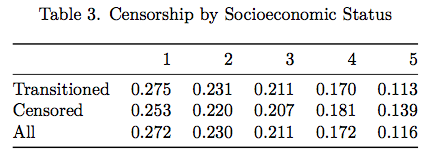
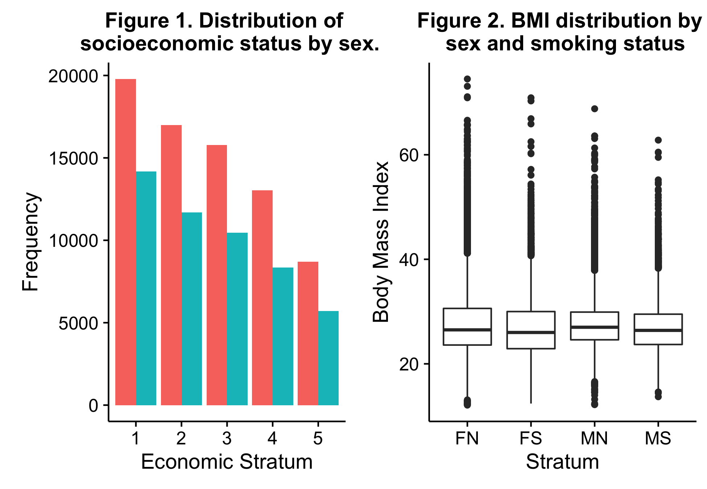

```{r, echo=F, message=F}

# Libraries
library(ggplot2)
library(survival)
library(plyr)
library(dplyr)
library(knitr)
library(lattice)
library(cowplot) # for adjacent plots
library(png)
library(grid)

# Function to create nice Survival Curves
# From: https://www.r-statistics.com/2013/07/creating-good-looking-survival-curves-the-ggsurv-function/
ggsurv <- function(s, CI = 'def', plot.cens = T, surv.col = 'gg.def',
                   cens.col = 'red', lty.est = 1, lty.ci = 2,
                   cens.shape = 3, back.white = F, xlab = 'Time',
                   ylab = 'Survival', main = ''){
  
  library(ggplot2)
  strata <- ifelse(is.null(s$strata) ==T, 1, length(s$strata))
  stopifnot(length(surv.col) == 1 | length(surv.col) == strata)
  stopifnot(length(lty.est) == 1 | length(lty.est) == strata)
  
  ggsurv.s <- function(s, CI = 'def', plot.cens = T, surv.col = 'gg.def',
                       cens.col = 'red', lty.est = 1, lty.ci = 2,
                       cens.shape = 3, back.white = F, xlab = 'Time',
                       ylab = 'Survival', main = ''){
    
    dat <- data.frame(time = c(0, s$time),
                      surv = c(1, s$surv),
                      up = c(1, s$upper),
                      low = c(1, s$lower),
                      cens = c(0, s$n.censor))
    dat.cens <- subset(dat, cens != 0)
    
    col <- ifelse(surv.col == 'gg.def', 'black', surv.col)
    
    pl <- ggplot(dat, aes(x = time, y = surv)) +
      xlab(xlab) + ylab(ylab) + ggtitle(main) +
      geom_step(col = col, lty = lty.est)
    
    pl <- if(CI == T | CI == 'def') {
      pl + geom_step(aes(y = up), color = col, lty = lty.ci) +
        geom_step(aes(y = low), color = col, lty = lty.ci)
    } else (pl)
    
    pl <- if(plot.cens == T & length(dat.cens) > 0){
      pl + geom_point(data = dat.cens, aes(y = surv), shape = cens.shape,
                      col = cens.col)
    } else if (plot.cens == T & length(dat.cens) == 0){
      stop ('There are no censored observations')
    } else(pl)
    
    pl <- if(back.white == T) {pl + theme_bw()
    } else (pl)
    pl
  }
  
  ggsurv.m <- function(s, CI = 'def', plot.cens = T, surv.col = 'gg.def',
                       cens.col = 'red', lty.est = 1, lty.ci = 2,
                       cens.shape = 3, back.white = F, xlab = 'Time',
                       ylab = 'Survival', main = '') {
    n <- s$strata
    
    groups <- factor(unlist(strsplit(names
                                     (s$strata), '='))[seq(2, 2*strata, by = 2)])
    gr.name <-  unlist(strsplit(names(s$strata), '='))[1]
    gr.df <- vector('list', strata)
    ind <- vector('list', strata)
    n.ind <- c(0,n); n.ind <- cumsum(n.ind)
    for(i in 1:strata) ind[[i]] <- (n.ind[i]+1):n.ind[i+1]
    
    for(i in 1:strata){
      gr.df[[i]] <- data.frame(
        time = c(0, s$time[ ind[[i]] ]),
        surv = c(1, s$surv[ ind[[i]] ]),
        up = c(1, s$upper[ ind[[i]] ]),
        low = c(1, s$lower[ ind[[i]] ]),
        cens = c(0, s$n.censor[ ind[[i]] ]),
        group = rep(groups[i], n[i] + 1))
    }
    
    dat <- do.call(rbind, gr.df)
    dat.cens <- subset(dat, cens != 0)
    
    pl <- ggplot(dat, aes(x = time, y = surv, group = group)) +
      xlab(xlab) + ylab(ylab) + ggtitle(main) +
      geom_step(aes(col = group, lty = group))
    
    col <- if(length(surv.col == 1)){
      scale_colour_manual(name = gr.name, values = rep(surv.col, strata))
    } else{
      scale_colour_manual(name = gr.name, values = surv.col)
    }
    
    pl <- if(surv.col[1] != 'gg.def'){
      pl + col
    } else {pl + scale_colour_discrete(name = gr.name)}
    
    line <- if(length(lty.est) == 1){
      scale_linetype_manual(name = gr.name, values = rep(lty.est, strata))
    } else {scale_linetype_manual(name = gr.name, values = lty.est)}
    
    pl <- pl + line
    
    pl <- if(CI == T) {
      if(length(surv.col) > 1 && length(lty.est) > 1){
        stop('Either surv.col or lty.est should be of length 1 in order
             to plot 95% CI with multiple strata')
      }else if((length(surv.col) > 1 | surv.col == 'gg.def')[1]){
        pl + geom_step(aes(y = up, color = group), lty = lty.ci) +
          geom_step(aes(y = low, color = group), lty = lty.ci)
      } else{pl +  geom_step(aes(y = up, lty = group), col = surv.col) +
          geom_step(aes(y = low,lty = group), col = surv.col)}
    } else {pl}
    
    
    pl <- if(plot.cens == T & length(dat.cens) > 0){
      pl + geom_point(data = dat.cens, aes(y = surv), shape = cens.shape,
                      col = cens.col)
    } else if (plot.cens == T & length(dat.cens) == 0){
      stop ('There are no censored observations')
    } else(pl)
    
    pl <- if(back.white == T) {pl + theme_bw()
    } else (pl)
    pl
  }
  pl <- if(strata == 1) {ggsurv.s(s, CI , plot.cens, surv.col ,
                                  cens.col, lty.est, lty.ci,
                                  cens.shape, back.white, xlab,
                                  ylab, main)
  } else {ggsurv.m(s, CI, plot.cens, surv.col ,
                   cens.col, lty.est, lty.ci,
                   cens.shape, back.white, xlab,
                   ylab, main)}
  pl
}
```

```{r, echo=F}
# Load and join data
transitioned <- read.csv(file="~/Desktop/R/survival_Analysis/transitioned.csv", header=T)
censored <- read.csv(file="~/Desktop/R/survival_Analysis/censored.csv", header=T)
full <- rbind(transitioned, censored)

# Recode the event column -- otherwise it is treated incorrectly 
full$Partial_code_ff <- as.numeric(full$Partial_code_ff)    # Coerce the event variable to numeric
full$event <- ifelse(full$Partial_code_ff == 1, 1, 0)
```

# Introduction

The following is a full report on our data analysis project for the course PSTAT 196: Projects in Actuarial Science. Our analysis was completed during the Spring Quarter of 2017 under the supervision of Professor Ian Duncan and graduate student Shannon Nicponski at The University of California, Santa Barbara.

# About the Data

Our dataset comes from a longevity study performed in the United Kingdom from March 2006 to May 2014. Our team's subset of the original data is concerned only with high-risk patients developing severe hyper-tension. All participants in our dataset were already diagnosed with moderate hypertension. Our task was to model the time until diagnosis of sever hypertension--which lends itself to a classic Survival Analysis problem. Our dataset contains 126665 observations and 13 variables. A complete breakdown of the the variables is provided below.

  \begin{center} 
  \text{Table 1. A breakdown of all covariates in the original dataset} \\
  \end{center}
  
Name              | Explanation                                         | Range
-------------     | -------------                                       | -------------
UNQID             | A unique ID for each individual                     | 
Sex               | The patient's sex                                   | 1: 
Socio-Economic    | A categorical range indicating economic status      | 1: Affluent --> 5: Deprived
Socio-Econdate    | The date of the patient's economic evaluation       | 
EventDate         | The patient's event date                            | 
BMI               | The Body Mass Index of the individual               | 
Alcohol           | A binary indicator for drinking habits              | 1: Drinker, 0: Non-Drinker
Cigar             | A binary indicator for smoking habits               | 1: Smoker, 0: Non-Smoker
YOB               | The year of birth of the individual                 | 
Duration          | Time in days spent in the study                     | [0, ???]
Partial_code_pre  | Enter code                                          | Always 2000
Partial_code_ff   | Transition Code                                     | 2000 := Censored, 
.                 |    .                                                | 3000 := Transitioned
Age_Pre           | Age upon entry to the study                         |
Age_Post          | Age at the EventDate                                |

As you can see, some variables (such as YOB, duration, Age\_Pre, Age\_Post) are redundant. When our team began the modeling phase, we did not use every available covariate listed in the above table.

# Objectives
Our team set the following objectives to complete by the end of the quarter.

  1. Thoroughly explore the dataset for discrepancies or interesting trends
    + Make adjustments as necessary
  2. Fit a Cox-PH model to the data
    + Test model assumptions through Schoenfeld Residuals and Log-Log plots
    + Narrow model to the most significant predictors
  3. Attempt k-fold cross validation of the decided Cox model
  4. If time allows, we chose to pursue the following as well:
    + Non-parametric modeling techniques

# Exploratory Analysis

Once our group recieved the dataset, we thuroughly explored the variables using two-way tables and visualizations.

## Tabluar Analysis

```{r out.width = "325px", fig.align="center", echo=FALSE}

```

```{r, out.width = "250px", echo=FALSE, fig.align="center"}

```

```{r, out.width = "350px", fig.align="center", echo=FALSE}

```


## Discrepancies

Table 4 shows some *very* concerning BMI values. The maximum ranges as high as 66000, and some as low as 10. A reasonable range for BMI values is between 18 and 60. We concluded that this was likely the result of an error during data entry or data transfer. Luckily, there were only 326 records that were outside of [12, 100], so we opted to remove those observations which were outside of that range. We decided on 100 as the upper limit because it *is* possible for a human to have a BMI close to 100. Furthurmore, our data is concerned with patients that already developed moderate hyptertension. So it is absolutely possible that an individual has a BMI between 60 and 100.

Next, we found that there *are* some redundant records for a single individual (multiple occurances of a single UNQID). This is because some individuals had their economic status re-evaluated during the study. Luckily, this accounted for only a small set of the data: 278 records. Our team decided to keep only the earliest records and drop any duplicate record with the re-evaluated socioeconomic status. Lastly, we found roughly 200 records with negative age values. Professor Ian Duncan, who had worked with the dataset in the past, advised us to remove all observations with either negative age values or survival times equal to zero. We followed his advisement.

```{r, echo=F}
# Recode the response, the Survival package misread the original encoding
full$event <- as.numeric(full$Partial_code_ff)
full$event <- ifelse(full$event == 2, 0, 1)

# Remove outlier BMI values 
full$BMInew <- ifelse(full$BMInew > 75 | full$BMInew < 12, NA, full$BMInew)
full <- na.omit(full)

# Coerce the date strings to proper date types
longFormat = "%d/%m/%Y"
shortFormat = "%d/%m/%y"
full$Socio.Econdate <- as.character(full$Socio.Econdate)
full$Socio.Econdate <- ifelse(full$Socio.Econdate != "", full$Socio.Econdate, NA)
longYear <- grep(pattern = ".+\\d{4}$", x=full$Socio.Econdate)
shortYear <- !(seq(1, nrow(full)) %in% longYear)
long <- full[longYear, ]
short <- full[shortYear, ]
long$Socio.Econdate <- as.Date(long$Socio.Econdate, format=longFormat)
short$Socio.Econdate <- as.Date(short$Socio.Econdate, format=shortFormat)

# Sort by date
full <- rbind(long, short)
ordered <- full %>%
  arrange(Socio.Econdate)

# Find duplicate records and remove them
duplicates <- duplicated(ordered$UNQID_tmp)
full <- ordered[!duplicates, ]

# Create quantiles for BMI values
bmiQuants <- quantile(full$BMInew, seq(0, 1, 0.25))
full$bmiCat <- cut(full$BMInew, unique(bmiQuants), include.lowest=TRUE)
full$bmiCat <- factor(full$bmiCat, unique(levels(full$bmiCat))[c(1,2,3,4)], labels=c("Low", "Medium", "High", "Obese"))

# Create a single variable that encodes sex and smoking status
full$SC <- ifelse(full$sex == 1 & full$cigar == 1, "MS",
           ifelse(full$sex == 2 & full$cigar == 1, "FS",
           ifelse(full$sex == 1 & full$cigar == 0, "MN", "FN")))
full$SC <- as.factor(full$SC)

# Remove variables with negative ages and zero survival time
full$AGE_PRE <-  ifelse(full$AGE_PRE <= 0, NA, full$AGE_PRE)
full$DURATION <- ifelse(full$DURATION == 0, NA, full$DURATION)
full <- na.omit(full)

```

## Further Analysis

After removing observations with outlandish BMI values, duplicate observations, negative ages, and zero survival time, we continued our exploratory analysis. By this point in the project, our dataset contains `r nrow(full)` rows.

```{r, message=F, echo=F}
# socio-economic breakdown by sex

# Make a frequency table
socioSex <- as.data.frame(as.matrix(table(full$Socio.Economic, full$sex)))
names(socioSex) <- c("econ", "sex", "freq")
socioSex$sex <- as.factor(ifelse(socioSex$sex == 1, "Male", "Female"))

# The ggplot
fig1 <- 
  ggplot(socioSex) +
  geom_col(aes(x=econ, y=freq, fill=sex), position = "dodge") +
  ggtitle("Figure 1. Distribution of \n socioeconomic status by sex.") +
  xlab("Economic Stratum") +
  ylab("Frequency") +
  theme(legend.position="none")
```

```{r, message=F, echo=F}
# Violin plot of BMI by duration

colorCode <- function(someFactor){
  ifelse((someFactor == "FN" | someFactor == "FS"), "red", "darkcyan")
}

colorCodes <- lapply(full$SC, FUN=colorCode)

fig2 <-
  ggplot(full) +
  geom_violin(aes(x=as.factor(SC), BMInew)) +
  ggtitle("Figure 2. BMI distribution by \n sex and smoking status") +
  ylab("Body Mass Index") +
  xlab("Stratum") 

fig1_2 <- plot_grid(fig1, fig2)
ggsave(filename = "fig1_2.png", fig1_2)
```

```{r,  fig.align="center", echo=F, out.width="525px", out.height="300px"}

```

In Figure 1, red corresponds to women and blue to men. We can see that there are more females in the dataset--roughly 3 women for every 2 men. The distributions of economic status are similar between the sexes. Figure 2 is a violin plot, so a wider horizontal portion corresponds to a more dense concentration of data at that value. It seems that women's BMI values are distributed more widely, while the men's BMI values are more densely distributed about their respective means.

# Modeling

Now that we have explored the dataset, we begin our modeling phase. First, our team constructed simple Kaplan-Meier estimate plots for each stratum of variables concerning alcohol consumption, Body Mass Index, sex, and cigarette consumption. We then moved on to construct two Cox Proportional-Hazards models: one with every covariate available, and a second with only those covariates which satisfied the proportional-hazards assumption. We constructed the reduced model to properly interpret the interactions. We constructed the full model in the hopes that it may provide some predictive power for future cases of sever hypertension. To test the predictive capabilities of the full model, we used cross validation on a single fold. All these steps are discussed in the following sub-sections.

```{r, message=F, echo=F}
# Make the Survival objects
survObject <- Surv(full$DURATION, event=full$Partial_code_ff)
bmiKM <- survfit(survObject ~ full$bmiCat)
alcKM <- survfit(survObject ~ full$alcohol)
SCKM <-  survfit(survObject ~ full$SC)
```

## Kaplan Meier Plots

Here we have Kaplan-Meier plots for each of the covariates listed in the section introduction.

```{r, echo=F, message=F}
fig3 <- 
  ggsurv(alcKM, plot.cens = F) +
  ggtitle("Figure 3. KM Estimates \n by Alcohol Consumption") +
  theme(legend.position="none") +
  ylab(expression("P(T">="t)"))

fig4 <- 
  ggsurv(bmiKM, plot.cens = F) + 
  ggtitle("Figure 4. KM Estimates \n by BMI Level") +
  guides(fill=guide_legend(title="BMI Level")) +
  ylab("")

fig5 <-
  ggsurv(SCKM, plot.cens = F)  +
  ggtitle("Figure 5. KM Estimates \n by Sex and Cigarette Usage") +
  guides(fill=guide_legend(title="Sex/Smoker")) +
  ylab(expression("P(T">="t)"))

# 2 plots in first, 1 in row
fig2_3_4 <- cowplot::plot_grid(fig3, fig4, fig5, nrow = 2)
ggsave(filename = "fig2_3_4.png", plot = fig2_3_4)
```

```{r,  out.align="center", echo=F, out.width="525px", out.height="800px"}

```

_Fix these plots. Either one per row, or move legends into the open cell on bottom right (if that's possible)._

The factor levels in Figure 4 are broken down by quantile; please see Table 5 shown below. In Figure 5, the first letter corresponds to the sex, and the second letter corresponds to their smoking status (**s**moker or **n**onsmoker).

_Needs a title_

| Quantile Name | BMI Range     |
|:-------------|:-------------:|
| Low           | [12.1, 23.9)  |
| Medium        | [23.9, 26.7)  |
| High          | [26.7, 30.2)  |
| Obese         | [30.2, 74.5]  | 

## Cox Modeling
